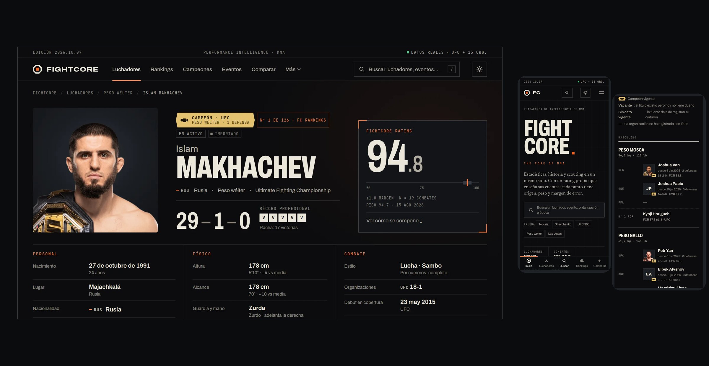

<p align="center">
  <picture>
    <source media="(prefers-color-scheme: dark)" srcset="docs/brand/logo-dark.png">
    
  </picture>
</p>

<p align="center"><strong>The core of MMA.</strong> Datos, historia y scouting de artes marciales mixtas.</p>

<p align="center"></p>

## Qué es

- **Fichas de 8.700 luchadores** con retrato, datos físicos, récord por organización e informe de fortalezas y puntos débiles.
- **FIGHTCORE Rating** (escala 50–100), un rating propio y público que explica sus cuentas.
- **Rankings, campeones y eventos** de UFC, PFL, ONE, Bellator, RIZIN, KSW y más.
- **Comparador**, buscador, modo claro y oscuro, y funciona sin conexión como app.

Datos de UFCStats, ESPN, Wikipedia y Wikidata, actualizados cada lunes. Proyecto independiente, sin relación con ninguna organización.

## Arrancar

```bash
npm install
npm run dev        # http://localhost:3000
```

## Publicar

- **Web:** Vercel, sin configuración.
- **App móvil:** PWABuilder, guía en [`docs/APP-MOVIL.md`](docs/APP-MOVIL.md).

Más detalle (fuentes, rating, scripts, actualización semanal): [`docs/DESARROLLO.md`](docs/DESARROLLO.md).
